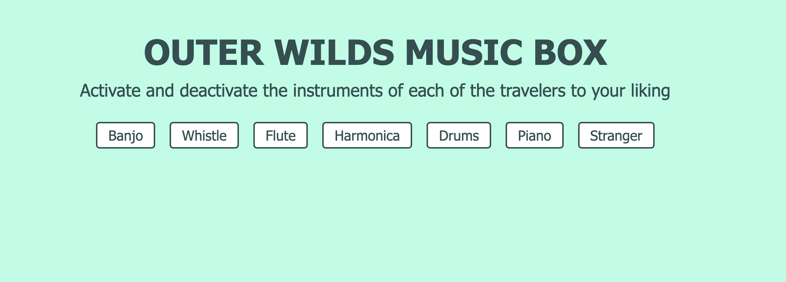

# OUTER WILDS MUSIC BOX

> **Disclaimer:** This application is no longer in development. A newer, more modern version is being developed at the following link: [New Version Link](https://github.com/arnaldo10cisne/outer_wilds_music_box_v2)

## Description

**OUTER WILDS MUSIC BOX** is a web application that allows you to interactively explore the musical ensemble of the travelers from the game _Outer Wilds_. Customize your auditory experience by activating or deactivating individual instruments to create your own unique rendition of the game's iconic soundtrack.

## Features

- **Interactive Instrument Control**: Toggle individual instruments on or off to tailor the music to your preference.
- **Seamless Audio Transition**: Instruments fade in and out smoothly without interrupting the flow of the music.

## Technologies Used

- **React**: A JavaScript library for building user interfaces.
- **HTML5 Audio API**: For handling audio playback and control.

## Contributing

Contributions are welcome! Feel free to open an issue or submit a pull request.
